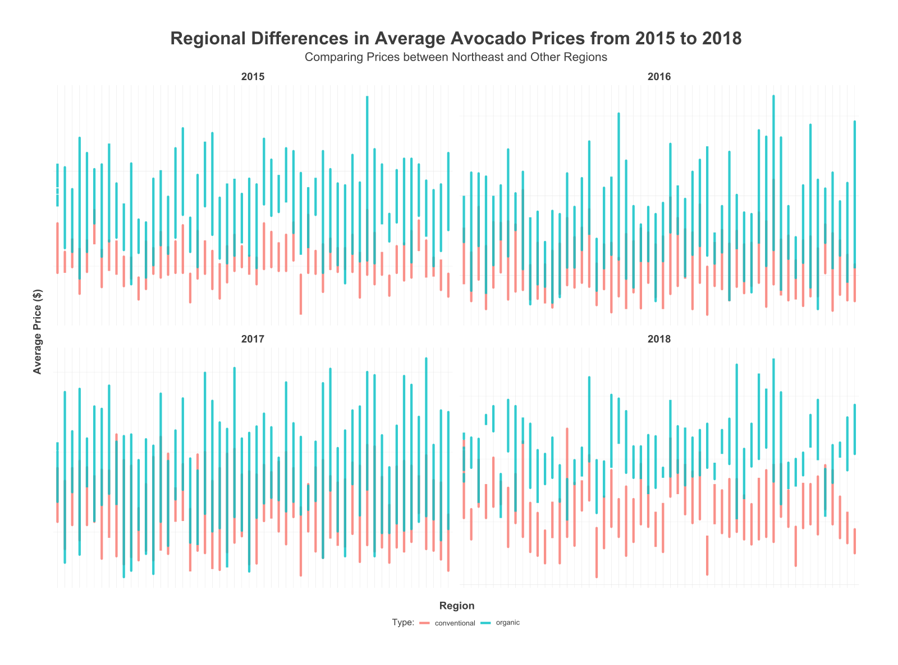

# Avocado Price Trends by Region (2015-2018)

This project analyzes regional variations in avocado prices in the United States from 2015 to 2018, with a focus on comparing prices between the Northeast and other regions. The analysis is based on data from [Gapminder](https://www.gapminder.org/data/).

### Project Files

- `avocado_sales.csv`: Raw data file containing avocado sales data
- `main.R`: R script for data cleaning, analysis, and visualization
- `README.md`: This file

### Requirements

This project requires the following R packages:

- ggplot2
- dplyr
- ggthemes
- extrafont
- readr
- gganimate
- gapminder

### Usage

To reproduce the analysis, open the `main.R` script in R or RStudio and run the code. The script will download the necessary data from Gapminder and generate visualizations comparing avocado prices by region and by year.

### Results

Our analysis shows that avocado prices varied significantly by region and year. While the Northeast region generally had higher average prices than other regions, there were exceptions depending on the year. Additionally, prices increased across all regions between 2015 and 2017, before decreasing in 2018.

For more detailed analysis and visualizations, please see the `main.r` file.

### Reference images:

### License

This project is licensed under the [MIT License](LICENSE.md).
